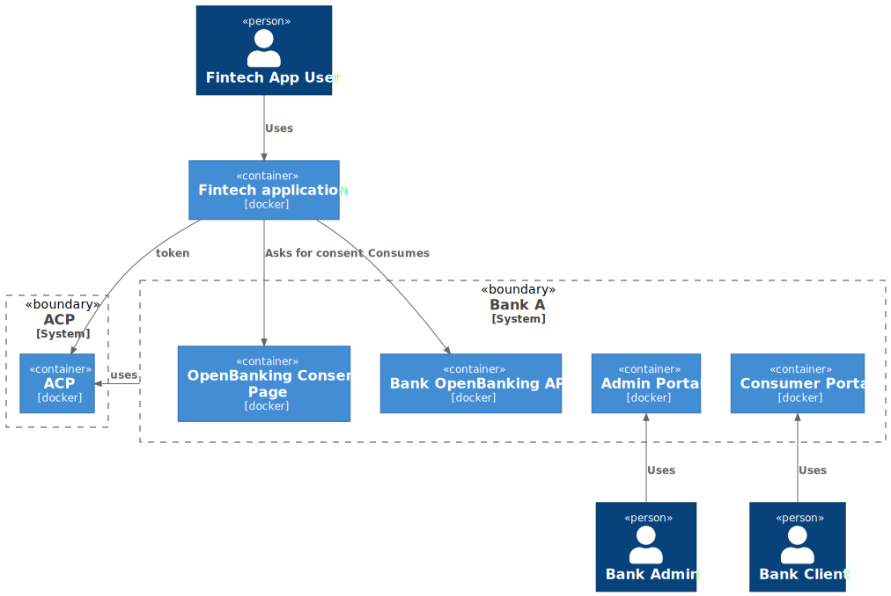
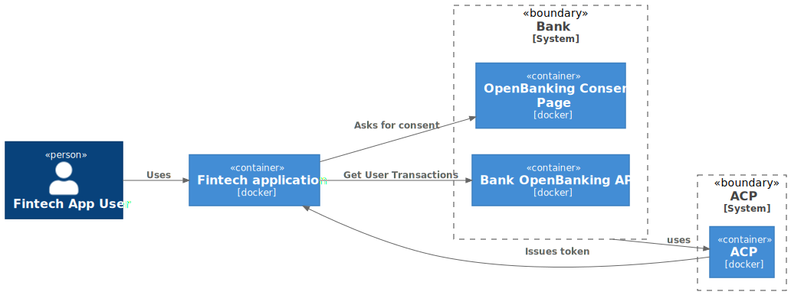

# Openbanking Sandbox with Cloudentity ACP

This repository contains an Openbanking Sandbox, showcasing how Cloudentity ACP supports
Openbanking usecases.

There are several applications in this repository.

- Bank

  - Bank APIs
  - Bank Administrative Portal
  - Bank Consumer Portal
  - Bank Openbanking Consent Page

- Fintech apps

  - Financroo - sample fintech aggregator
  - Developer TPP - technical TPP application

- ACP - Cloudentity Authorization Control Plane

Logical system diagram:

## Usecases

This sandbox provides solutions for different use-cases for few different
personas.

### Fintech App User

Usecase: Fintech aggregator
User has multiple banking accounts, he'd like to see all his finances in one place.

Solution: Thanks to the standards which Openbanking defines, fintech applications
can connect to multiple financial institutions using the same secure APIs.

ACP allows the bank to expose Openbanking compliant APIs securely, make sure
that only trusted, secure clients can access bank's APIs.

Simplified flow

### Bank Administrator

Usecase: Revoke TPP consents

Admin wants to revoke all consents given to a TPP - due to the client being compromised.

Solution: ACP stores information about all the consents given to the TPP.

`consent-admin` application contains a sample bank administration portal.
It lists all TPPs and allows to revoke all consents given to a particular TPP.
